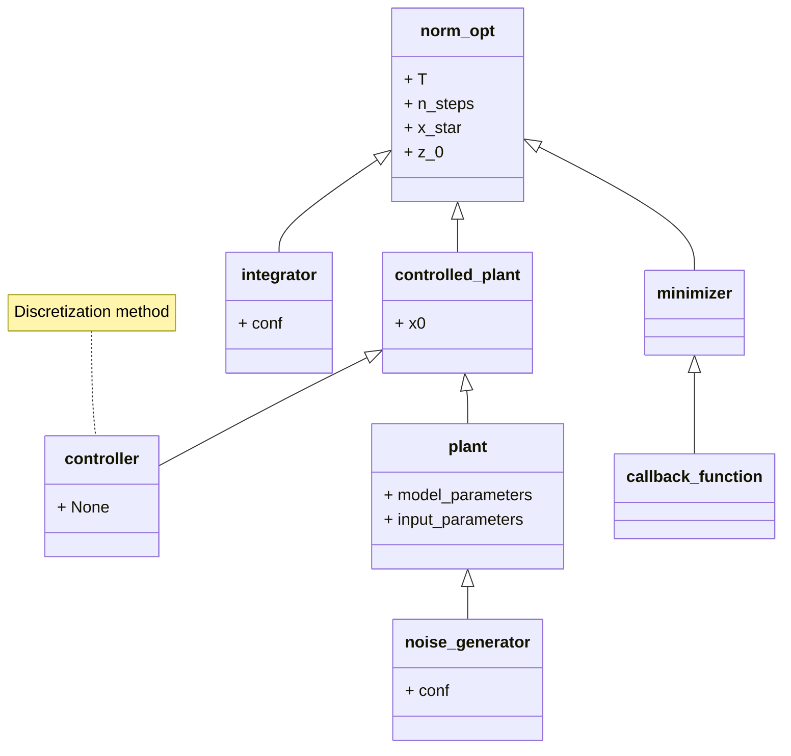

# Optimization

The norm optimization implements an optimization framework to get the optimal trajectory over a given time 

The first step is to instantiate a `Optimization`-object

## Types of optimization

All optimization types are build by the same scheme but require different packages to build, a 




```python
example_norm_opt = UOptimization('example')
```

To configure this 

# Simulation configuration 

To implement the optimization the underlying simulation configuration has to be set up first. This is very similar to the configuration of a `simulation`-object: 

## Controlled plant 

The plant for the underlying integration has to be configured and needs: 

+ A parametrized model 
+ A feedforward controller (first- or zero-order hold is implemented at this point)
+ An integration methode
+ An initial value

Firstly the controlled plant has to be instantiated from the `controlled_plants`-module

```python
from controlled_plants import ControlledPlant

example_controlled_plant = ControlledPlant() 
```

### Model

Configure the used model and pass it to the `controlled_plant` by getting it from the `models`-module.

```python
from models import INA

model_parameters = {'an': 1.3343, 'bn': -8.6824, 'aa': 12.0465, 'ba': -16.45, 'n': 2}  # J3
input_parameters = {'cSR1': 11.5, 'cDR1': 4., 'cSR2': 0., 'cDR2': 0., 'cSR3': 0., 'cDR3': 0.}

example_model = INA(model_parameters, input_parameters)
example_controlled_plant.set_plant(example_model)
```

Process noise is still missing here

### Controller

The controller creates the discretization method. Create an instance from the `controllers.feedforward`-module.

```python
from controllers.feed_forward import ZeroOrderHold

# time and input can be given as `None` (will be overwritten anyway)
example_controller = ZeroOrderHold(None, None)
example_controlled_plant.set_controller(example_controller)
```

### Initial value

An initial value has to be set to the plant

```python
x0 = np.asarray([0, 0, 0, 0, .8])
example_opt.controlled_plant.set_initial_value(x0)
```

Fumble it all together

```python
example_opt.set_controlled_plant(example_controlled_plant)
```

## Integration method

The integration method has to be chosen from the `numeric.interation`-module

```python
from numeric.integration import SciPy

example_integrator = SciPy()
example_opt.set_integrator(example_integrator)
```

# Optimization configuration

The optimization itself has to be configured as well using: 

+ An Error function and according weights
+ An initial guess for the input trajectory 
+ An optimization algorithm 
  + Optional callback method
+ Optimization constraints (box-constraints in our case)

## Set point

The set point to norm-optimally reach has to be set by

```python
x_star = np.asarray([0.11525703, 0.32221684, 0.08651147, 0.19054012, 1.])
example_opt.set_x_star(x_star)
```

## Optimization algorithm 

The optimization algorithm has to be chosen from the `optimization.minimizer`-module

```python
from optimization.minimizer import TrustReg

example_opt_alg = TrustReg()
example_opt.set_minimizer(example_opt_alg)
```

Optionally a callback methode can be added to the optimizer using the package `optimization.opt_callbacks`

```python
from optimization.opt_callbacks import LogSteps

log_process = LogSteps()
example_opt_alg.set_callback(log_process)
example_opt.set_minimizer(example_opt_alg)
```

## Set bounds

For the optimization upper and lower input bounds have to be set. They are given in the form `[lim1, lim2, lim3, lim4]`, whereas limi is either `[low, up]` or `None` if the flow is not used.

```python
pump_limits = [[0., .1], None, [0., .1], None]
example_opt.set_bounds(pump_limits)
```

## Set time configuration

The length of the time-interval as well as the discretion method is set via the .set_-methode. The time-grid can

```python
n_steps = 10
t_end = 100
example_opt.set_t(t_end, n_steps, mode="lin") # mode="geom" is also possible 
```

## Set cost function and weights

The cost function has to be provided from the package `optimization.cost_functions` (Has to be a child-class of `NormOptmization`) 
```python
from optimization.cost_functions import NormOptError

k_end = np.asarray([1., 0., 2., 1., 1.]) * 1e1
k_i = np.asarray([0])
k_reg = np.asarray([1., 1., 1., 1.]) * 0e0
norm_weights = (k_end, k_i, k_reg)
example_opt.set_weight(norm_weights)

example_opt.set_cost_function(NormOptError()) 
```

## Set initial guess

Finally a inital guess has to be provided for the optimizer. The package `utils.input_utils` provides a function to construct a constant input from a vector of length `n`


# Run everything
Finally everything can be run and plottet by using