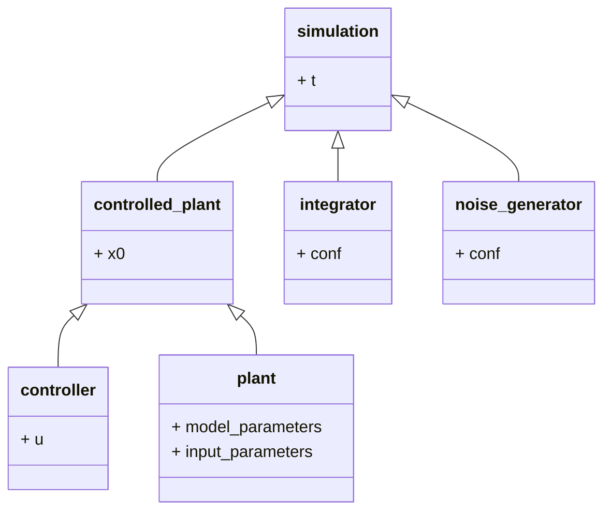

# Configure Simulation

The simulation process-object is used to simulate any controlled plant over a given time-vector `t`.

A controlled plant consists of a plant or model from`models`, a controller from controllers `controllers` and an initial value `x0`

The basic class diagram is as follows 




## Instantiating and naming

First instantiate a simulation process and name it
```python
from processes import Simulation

example_simulation = Simulation('example simulation')
```

## Instantiating controlled plant

The controlled plant has to be instantiated first

```python
from controlled_plants import ControlledPlant

example_controlled_plant = ControlledPlant()
```

### Model

Now a model and its model parameters has to be chosen: 

```python
from models import INA

model_params = {'an': 1.8038, 'bn': -13.6793, 'aa': 58.4058, 'ba': -23.0235, 'n': 2}
input_params = {'cSR1': 11, 'cDR1': 4, 'cSR2': 0, 'cDR2': 0, 'cSR3': 0, 'cDR3': 0.031}

example_model = INA(model_params, input_params)
example_controlled_plant.set_plant(example_model)

# alternatively
example_controlled_plant.set_plant(INA, model_params, input_params)
```

### Inital Value

The initial value of the controlled plant is set via

```python
x_0 = np.asarray([0, 0, 0, 0, 0.8])

example_controlled_plant.set_inital_value(x_0)
```

### Controller

Here a simple feed forward controller gets set

```python
from controllers import Step

example_controller = Step(0, np.asarray([0.005, 0, 0, 0]))
example_controlled_plant.set_controller(example_controller)

```

## Configure simulation 

First plug the controlled and configured plant into the simulation process

```python
example_simulation.set_controlled_plant(example_controlled_plant)
```

Next the simulation parameters itself have to be set. To do that a time horizont and an integration-method has to be chosen. 

```python
from numeric import SciPy

t_sim = 30  # [h]
t_sp = 60  # [s]

example_simulation.set_t(t_sim, t_sp)
example_simulation.integrator = SciPy()
```

Optionally a measurement noise can be chosen. Noise is deactivated if not given otherwise

```python
from numeric.noise import Gauss

example_simulation.add_noise_generator(Gauss(.001))
```

# Run Simulation

Now the simulation can be simply run and plotted by calling

```python
example_simulation.run_process()
example_simulation.plot_process()
```